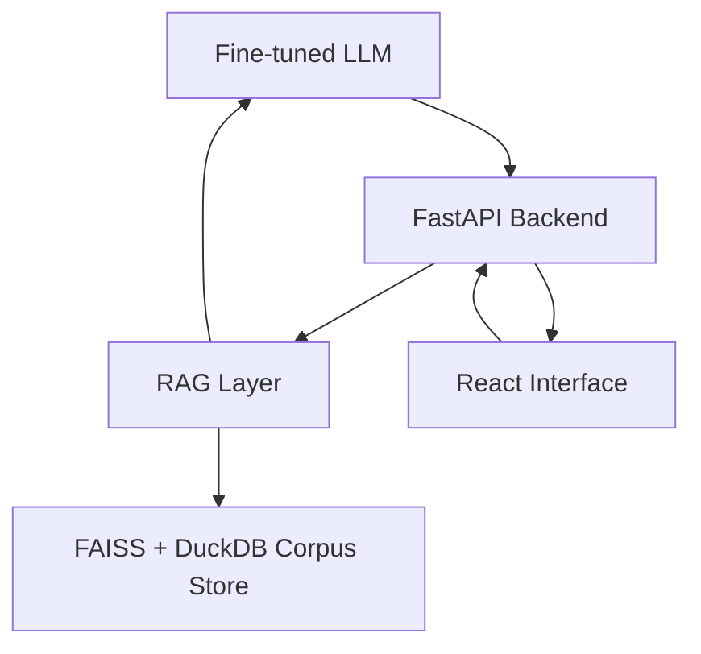

# NyayaSetu

NyayaSetu is a self-hosted legal intelligence platform for Indian law. The stack uses open-source models, FAISS retrieval, SQLite for application state, DuckDB for corpus analytics, and manifest-driven ingestion from official legal sources.

## Architecture



## Storage Layer

- `SQLite`: app audit logs and lightweight metadata.
- `DuckDB`: corpus documents, chunk analytics, target tracking, and section mappings.
- `FAISS`: vector similarity index.
- `JSONL`: ingestion manifests and processed corpus exports.
- `Filesystem`: uploaded files and downloaded official documents.

## Repository Layout

```text
NyayaSetu/
|- backend/                    FastAPI app, legal orchestration, SQLite/DuckDB hooks
|- frontend/                   React + Vite client
|- training/                   Dataset prep, QLoRA fine-tuning, evaluation
|- rag/                        FAISS indexing and retrieval
|- ingestion/                  Official-source download, cleaning, chunking, corpus stats
|- deployment/                 vLLM, TGI, and deployment assets
|- docker/                     Container builds
|- data/                       Corpus outputs, analytics DB, sample bootstrap data
|- infra/                      DuckDB bootstrap SQL
`- storage/                    SQLite DB and uploaded evidence
```

## Hugging Face Space Deployment

This repository is configured for a backend-only Docker Space deployment on Hugging Face.

Deployment shape:

- Root `Dockerfile` runs the FastAPI backend only.
- The Space exposes API routes and Swagger docs for an external frontend such as Loveable.
- Default Space port is `7860`.
- Current Docker image uses `backend/requirements.no-whisper.txt` to avoid blocking the Space build on Whisper packaging.
- Set `FRONTEND_URL` in the Space settings to your deployed Loveable frontend URL so browser requests are allowed by CORS.

Suggested Space settings:

- SDK: `Docker`
- Hardware: `CPU Basic` for API and FAISS demos, `GPU` only if you attach heavier local inference
- Visibility: `Private` for personal use

Push flow:

1. `git remote add space https://huggingface.co/spaces/ABHISHEK785/Nyaya_setu`
2. `git add .`
3. `git commit -m "Configure NyayaSetu for Hugging Face Space deployment"`
4. `git push space main`

After the build finishes, the app should be available at your Space URL and serve:

- backend info or fallback response from `/`
- FastAPI docs from `/docs`
- API routes from `/api/v1/*`
- Loveable prompt template from `deployment/loveable/frontend_prompt.md`

## Official Source Ingestion

Primary source manifest:

- `ingestion/configs/official_sources.json`

Current source coverage in code:

- Gazette of India / eGazette
- Ministry of Law and Justice / Legislative Department act listings
- BNS, BNSS, and BSA official downloads
- IPC and CrPC historical references
- Indian Contract Act
- IT Act
- Supreme Court of India latest judgments
- High Court source manifest template for court-specific expansion

Pipeline:

1. `python ingestion/scripts/fetch_official_sources.py`
2. `python ingestion/scripts/build_legal_corpus.py`
3. `python rag/indexing/build_faiss_index.py`
4. `python ingestion/scripts/corpus_stats.py`

## Corpus Processing Features

- Statute chunking by section and chapter boundaries.
- Judgment chunking by passage windows.
- Heuristic judgment and statute summarization.
- Citation extraction and linked-citation fields on each chunk.
- Multilingual embedding support through `BAAI/bge-m3` for English and Hindi.
- DuckDB-backed tracking for corpus size against targets.
- Optional IPC/BNS mapping load via `ingestion/configs/ipc_bns_mappings.csv`.

Target corpus scale:

- `10k+` statute chunks
- `50k+` case law passages
- structured IPC/BNS mapping rows

## Backend API

- `GET /api/v1/health`
- `POST /api/v1/chat/query`
- `POST /api/v1/analysis/case`
- `POST /api/v1/analysis/strength`
- `POST /api/v1/analysis/draft`
- `POST /api/v1/analysis/fir`
- `POST /api/v1/research/search`
- `POST /api/v1/documents/contract/analyze`
- `POST /api/v1/documents/evidence/analyze`
- `POST /api/v1/admin/dataset/refresh`
- `GET /api/v1/admin/corpus/status`

## Inference Modes

- `mock`: development scaffold mode.
- `local_pipeline`: direct `transformers` inference inside the backend.
- `vllm`: self-hosted OpenAI-compatible endpoint.
- `tgi`: self-hosted Text Generation Inference endpoint.
- `ollama`: optional local development provider.

## Training Pipeline

1. Build the official corpus and FAISS index.
2. Prepare train and eval JSONL:

```bash
python training/scripts/prepare_dataset.py
```

3. Fine-tune with QLoRA:

```bash
python training/scripts/train_qlora.py --config training/configs/finetune_qlora.yaml
```

4. Evaluate:

```bash
python training/scripts/evaluate_model.py --model-path path/to/model_or_adapter
```

## Local Run

Backend:

```bash
cd backend
uvicorn app.main:app --reload
```

Frontend:

```bash
cd frontend
npm install
npm run dev
```

## Docker

Core services:

```bash
docker compose up --build
```

Optional self-hosted inference:

```bash
docker compose --profile gpu up inference backend
docker compose --profile ollama up ollama backend
```

## Notes

- The backend now defaults to SQLite and DuckDB; PostgreSQL is no longer the primary path.
- The sample corpus remains only as a fallback bootstrap if the official corpus has not yet been built.
- Some official portals, especially High Courts and eCourts, need source-specific manifest entries because each court exposes judgments differently.
- All outputs remain informational and should be reviewed by qualified counsel before use.
